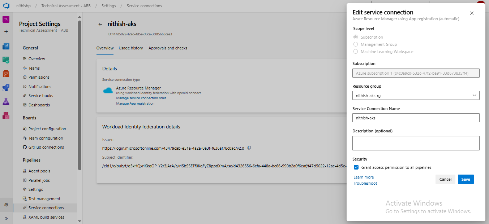
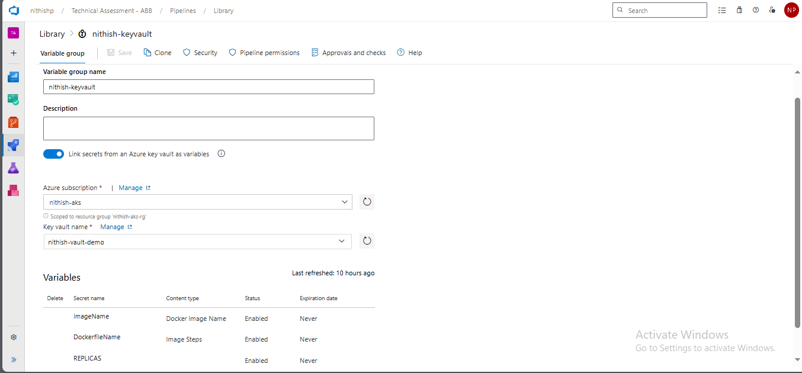
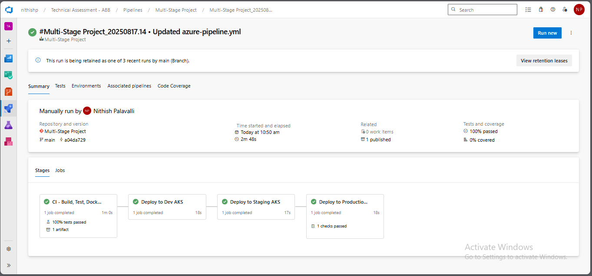

# Multi-Stage Deployment Pipeline - Dev, Staging, Production

## Overview

This project implements a **multi-stage CI/CD pipeline** in **Azure DevOps** for deploying a Node.js application to **Azure Kubernetes Service (AKS)**.  

The pipeline ensures:
- **CI stage** for building, testing, and containerizing the app.  
- **Deployment to Dev, Staging, and Production** with environment-specific configurations.  
- **Namespace isolation** for each environment (`dev`, `staging`, `production`).  
- **ConfigMap application per environment**.  
- **Rollout verification** after every deployment.  

---

## Pipeline

**Pipeline Name:** `multi-stage-pipeline.yml`  

This pipeline runs automatically on commits to the **main branch** and publishes artifacts for deployment.  

---

## Stages in the Pipeline

### 1. **CI Stage (Build, Test, Dockerize)**
- Runs unit tests and publishes results.  
- Builds Docker image and pushes to **Azure Container Registry (ACR)**.  
- Packages source files, manifests, and other resources into a build artifact (`drop`).  

### 2. **Deploy to Dev**
- Deploys to **Dev namespace** in AKS.  
- Ensures namespace exists.  
- Applies Dev-specific `ConfigMap` from `configs/dev`.  
- Deploys manifests (`dev-deployment.yaml`).  
- Verifies rollout using:  
  ```bash
  kubectl -n dev rollout status deployment/my-app --timeout=60s
# Deployment Pipeline Documentation

## 3. Deploy to Staging

- Triggered after **Dev deployment** succeeds.  
- Deploys to **Staging namespace** in AKS.  
- Ensures namespace exists.  
- Applies Staging `ConfigMap` from `configs/staging`.  
- Deploys manifests (`staging-deployment.yaml`).  
- Rollout verified via:  
  ```bash
  kubectl -n staging rollout status deployment/my-app --timeout=60s
# 4. Deploy to Production

- Triggered after **Staging deployment** succeeds.  
- Deploys to **Production namespace** in AKS.  
- Ensures namespace exists.  
- Applies Production `ConfigMap` from `configs/production`.  
- Deploys manifests (`production-deployment.yaml`).  
- Rollout verified via:  
  ```bash
  kubectl -n production rollout status deployment/my-app --timeout=60s
## Environments

- **Dev:** used for feature validation.  
- **Staging:** used for pre-production testing.  
- **Production:** live environment for end users.  

**Namespaces:**  
- Dev → `dev`  
- Staging → `staging`  
- Production → `production`  

---

## 🔑 Key Vault Integration

Azure Key Vault secrets are securely integrated into the pipeline using **Azure DevOps Variable Groups** and a **Service Connection**.
# Azure Key Vault Setup

## Create Key Vault

Use the following Azure CLI command to create a Key Vault named **`nithish-keyvault`**:

```bash
# Variables
RESOURCE_GROUP=my-resource-group
LOCATION=eastus
KEYVAULT_NAME=nithish-keyvault

# Create Key Vault
az keyvault create \
  --name $KEYVAULT_NAME \
  --resource-group $RESOURCE_GROUP \
  --location $LOCATION \
  --sku standard \
  --enabled-for-deployment true \
  --enabled-for-template-deployment true \
  --enabled-for-disk-encryption true
```
---

### 1. Service Connection (Azure Resource Manager)

- Created in **Project Settings → Service Connections**.  
- Allows the pipeline to authenticate to **Azure Key Vault**.  
- Requires:  
  - Subscription ID  
  - Resource Group  
  - Vault Name  
- Permission: must have **Get & List** access on the Key Vault.  

📷 - 

---

### 2. Key Vault Variable Group

- Configured in **Pipelines → Library → Variable Groups**.  
- Linked to the **Azure Key Vault** via the service connection.  
- Automatically pulls secrets from Key Vault into the pipeline.  
- Secrets are **masked** in logs.  

📷 - 

---

### 3. Usage in Pipeline YAML

```yaml
variables:
- group: nithish-keyvault   # variable group linked to Key Vault

 # Docker build & push
        - task: Docker@2
          displayName: "Build & Push Docker Image"
          inputs:
            command: buildAndPush
            repository: $(imageName)
            dockerfile: $(DockerfileName)
            containerRegistry: $(dockerRegistryServiceConnection)
            tags: |
              v1
```
---

## Logs

- Logs for **CI, Dev, Staging, and Production deployments** are stored in this repository.  
- File: **`1_Job.txt`** (or equivalent).  
- Repo URL (to be added by you):  
  👉 ([[View Pipeline Logs](https://github.com/NithishReddyGithub/multi-stage-pipeline/tree/main/Production%20Deployment)] 

---

## Artifacts and Outputs

### Build Artifact
- Packaged at the end of the CI stage.  
- Contains application tarball + Kubernetes manifests.    

Example placeholders:  
-    

---

## How to Run the Pipeline

1. Commit changes to the **main branch**.  
2. Azure DevOps triggers the **CI stage**.  
3. CI builds & publishes artifacts + Docker image.  
4. CD stages proceed sequentially:  
   - Deploy → Dev → Staging → Production.  
5. Verify rollouts in AKS using `kubectl`.  
6. For detailed logs, check pipeline logs.  
